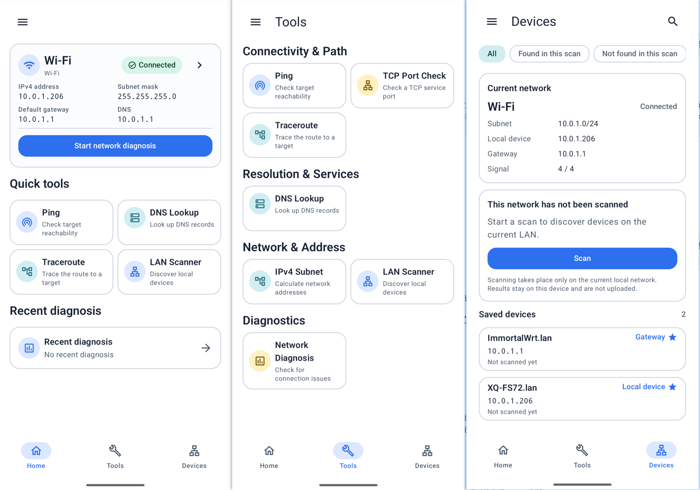

# LinkBeacon

English | [简体中文](README.zh-CN.md)


Open-source Android network analysis and troubleshooting toolbox.

**LinkBeacon by LY**

## Overview

LinkBeacon helps people understand the network state of an Android device, run
focused local checks, and collect evidence for troubleshooting. It is an
analysis aid, not an automatic repair tool or a system that claims to identify
every network fault with certainty.

NetworkToolbox was renamed to LinkBeacon in v0.5.0. The Android application ID
remains `com.networktoolbox` to preserve upgrade continuity.

## Development status

- **Latest stable release:** [v0.7.1](https://github.com/zhibo7841-hue/LinkBeacon/releases/tag/v0.7.1)

v0.7.1 polishes Device Center with one unified editor for Custom Name, Device
Type, and Notes. It also adds TCP Port Scan from Tools and Device Detail, with
Quick Scan, custom ranges, open-port results, common-service hints, Stop, and
automatic termination when the active network changes.

### What's new in v0.7.1

- Unified editing for a device's Custom Name, Device Type, and Notes.
- TCP Port Scan from Tools and Device Detail.
- A 24-port Quick Scan and custom inclusive ranges from 1 to 65535.
- Open-port results with clearly labelled common-service hints.
- Bounded concurrency, cancellable sockets, and network-change protection for
  safer scans.

### Upcoming v0.8.0

v0.8.0 is currently in release-candidate preparation. Its frozen scope adds:

- SSL/TLS Check with system-trust validation, certificate-chain details, and
  conservative result explanations.
- Website Diagnostics with staged DNS, TCP, direct TLS, and HTTPS evidence.
- Versioned, local-only TLS and Website History snapshots that reopen without
  repeating network requests or analysis.

This release is a network troubleshooting aid, not a vulnerability scanner or
security rating product. Report/PDF/Share integration, Automatic Diagnosis
integration, Port Scan-to-TLS shortcuts, Device Detail integration, cipher
enumeration, HTTP/3/QUIC, and Wi-Fi Analyzer remain outside v0.8.0.

## Screenshots

<p align="center">
  
</p>

## Features

- Local network information with IPv4 and IPv6 details.
- IPv4 subnet calculator.
- Ping with network-quality statistics and continuous checks.
- DNS Lookup for A, AAAA, CNAME, MX, and TXT records, including TTL details.
- TCP Port Check for a single host and port.
- IPv4 Traceroute with per-hop probe results.
- LAN Scanner for the current network or a bounded custom RFC1918 IPv4 range.

## Diagnostics

- Automatic Network Diagnosis with evidence-based explanations and suggestions.
- Diagnostic Reports with expandable technical details.
- Local History for completed checks and saved diagnostic reports.
- Report text copy, PDF export, and PDF sharing on explicit user action.

LinkBeacon presents observations, possible causes, and troubleshooting guidance.
It does not make absolute claims about routers, providers, services, or other
infrastructure when the available evidence cannot prove a single cause.

## Device Center

- Current-network device discovery and Device Details.
- Saved Devices and Favorites stored locally.
- Custom Device Names that remain unchanged across app languages.
- User-selected Device Types with consistent icons, plus local Device Notes.
- Truthful First Seen / Last Seen and Current / Last observed address labels.
- More conservative saved-device association that avoids transferring user
  data when available identity evidence is conflicting or ambiguous.
- Search and filters for current and saved devices.
- Local device identification using available Reverse DNS, mDNS / Bonjour, and
  SSDP / UPnP evidence.

## Wake-on-LAN

- Manual local Wake-on-LAN from Device Details.
- Quick Wake for eligible saved devices on the current local network.

A successful send means the Magic Packet was handed off; it does not guarantee
that the target device powered on or became reachable.

## Language support

v0.7.1 supports:

- English.
- Simplified Chinese.
- Follow system language.

Traditional Chinese is not currently a separately localized language. On
Android 13 and later, LinkBeacon integrates with the system per-app language
settings. Android 12 uses the compatible language setting inside the app.

## Privacy

- No ads.
- No account required.
- Local-first storage.
- Diagnostic data remains on the device.
- Saved devices, Custom Device Names, and Wake-on-LAN configuration remain local.
- Network diagnostic data is not uploaded to a cloud service.
- App-local data does not participate in Android system cloud backup by default.

LinkBeacon accesses the network only to perform checks explicitly initiated by
the user. This does not mean that diagnostic results are uploaded.

## Requirements

- Android 12 or later (`minSdk 31`).
- The project currently compiles and targets Android API 36.

## Download

The latest stable release is **v0.7.1**:

- [Download LinkBeacon-v0.7.1.apk](https://github.com/zhibo7841-hue/LinkBeacon/releases/download/v0.7.1/LinkBeacon-v0.7.1.apk)
- [Download the SHA-256 checksum](https://github.com/zhibo7841-hue/LinkBeacon/releases/download/v0.7.1/LinkBeacon-v0.7.1.apk.sha256)
- [View the v0.7.1 GitHub Release](https://github.com/zhibo7841-hue/LinkBeacon/releases/tag/v0.7.1)

The matching SHA-256 checksum is provided with the release assets. Existing
v0.7.0 installations can upgrade directly without clearing local data.

## Build and development

Prerequisites:

- Android Studio with Android SDK API 36.
- JDK 17.

Clone and build:

```bash
git clone https://github.com/zhibo7841-hue/LinkBeacon.git
cd LinkBeacon
./gradlew test
./gradlew assembleDebug
```

On Windows, use `gradlew.bat` instead of `./gradlew`. The debug APK is generated
at `app/build/outputs/apk/debug/app-debug.apk`. Release signing credentials are
maintainer-local and are not required for ordinary development builds.

## Documentation

- [Product plan](docs/PRODUCT_PLAN.md)
- [Architecture](docs/ARCHITECTURE.md)
- [Decision log](docs/DECISIONS.md)
- [Release plan](docs/RELEASE_PLAN.md)
- [v0.5.0 release notes](docs/V0.5_RELEASE_NOTES.md)
- [v0.6.0 release notes](docs/V0.6_RELEASE_NOTES.md)
- [v0.6.0 release readiness](docs/V0.6_RELEASE_READINESS.md)
- [v0.7.0 release notes](docs/V0.7_RELEASE_NOTES.md)
- [v0.7.0 release readiness](docs/V0.7_RELEASE_READINESS.md)
- [v0.7.1 release notes](docs/V0.7.1_RELEASE_NOTES.md)
- [v0.7.1 release readiness](docs/V0.7.1_RELEASE_READINESS.md)
- [v0.8.0 release notes](docs/V0.8_RELEASE_NOTES.md)
- [v0.8.0 release readiness](docs/V0.8_RELEASE_READINESS.md)
- [Published v0.4.0 release notes](docs/releases/v0.4.0.md)
- [Development workflow](docs/DEVELOPMENT_WORKFLOW.md)
- [UI design system](docs/UI_DESIGN_SYSTEM.md)
- [OSS research](docs/OSS_RESEARCH.md)

`docs/PRODUCT_PLAN.md` is the single product-scope baseline. The translated
README is not a separate roadmap.

## Contributing

Contributions in English or Chinese are welcome. See
[CONTRIBUTING.md](CONTRIBUTING.md) before opening a pull request.

## Security

Please follow [SECURITY.md](SECURITY.md) and report vulnerabilities privately.
Do not publicly disclose details of an unresolved vulnerability.

## License

LinkBeacon is released under the [Apache License 2.0](LICENSE).
