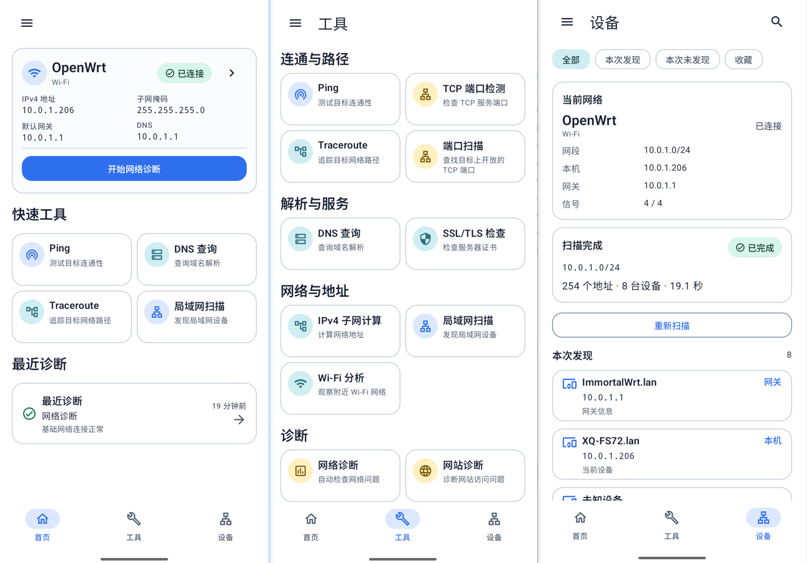

# LinkBeacon

[English](README.md) | 简体中文


开源 Android 网络分析与故障排查工具箱。

**LinkBeacon by LY**

## 项目介绍

LinkBeacon 帮助用户了解 Android 设备的网络状态、执行针对性的本地检测，
并收集可用于排障的证据。它是网络分析辅助工具，不是自动修复工具，也
不承诺能够确定性地识别所有网络故障。

NetworkToolbox 已在 v0.5.0 更名为 LinkBeacon。Android application ID
继续使用 `com.networktoolbox`，以保持现有安装的升级连续性。

## 开发状态

- **最新稳定版本：** [v0.8.0](https://github.com/zhibo7841-hue/LinkBeacon/releases/tag/v0.8.0)
- **待发布正式版本：** v0.9.0 — 正式签名制品已就绪，GitHub 发布待完成。

### v0.9.0 — Wi-Fi 分析

v0.9.0 新增当前 Wi-Fi 连接详情和 Android 提供的附近接入点观测。
可查看信号强度（dBm）、可用的频段、信道与安全类型，以及按信道汇总的
已观测 AP 数量和最强信号。用户手动点击刷新才会请求新的扫描结果；页面
区分新结果、缓存结果与新鲜度未知的结果，并支持搜索及 2.4/5/6 GHz
频段筛选。只有设备和 Android 实际提供扫描结果时才会显示 6 GHz 网络。

Android 要求精确位置权限和已开启的系统定位服务，才能提供附近 Wi-Fi
扫描信息；仅授予大致位置权限不足以解锁扫描。SSID、BSSID 等 Wi-Fi
观测数据只在本机处理，不上传，也不写入历史记录。本功能不测量实时
无线电频谱、干扰或信道占用率，也不推荐“最佳信道”。

### 之前的 v0.8.0 版本

- SSL/TLS 检测展示 TLS 连接、系统信任、主机名验证、证书有效期，以及协商的
  TLS 版本和密码套件证据。
- 网站访问诊断分阶段检查 DNS、TCP、TLS、证书、HTTP 和重定向；若观察到
  代理、VPN 或 Fake-IP 环境，会提供对应上下文。
- 版本化的 SSL/TLS 与网站诊断历史保存在本机，恢复不可变快照时不会重新请求
  网络或重新分析；敏感 URL 和响应信息在保存前经过遮盖。

这些检测解释本次连接路径与检测时刻的证据。新工具的报告/PDF/分享和自动诊断
集成留待后续版本。

### 之前的 v0.7.1 版本

v0.7.1 进一步完善设备中心，通过统一入口管理自定义名称、设备类型和备注。
同时新增从工具页和设备详情进入的 TCP 端口扫描，支持快速扫描、自定义范围、
开放端口结果、常见用途提示、停止扫描，以及网络切换时自动终止。

- 在同一入口统一编辑设备的自定义名称、设备类型和备注。
- 从工具页或设备详情执行 TCP 端口扫描。
- 24 个常用端口快速扫描，以及 1 到 65535 的自定义连续范围。
- 展示开放端口，并提供明确标注为提示的常见用途信息。
- 通过受控并发、可取消 Socket 和网络切换保护提升扫描安全性。

## 截图

<p align="center">
  
</p>

## 功能

- 本地网络信息与 IPv4、IPv6 详情。
- IPv4 子网计算器。
- Ping 网络质量统计与连续检测。
- DNS Lookup：支持 A、AAAA、CNAME、MX、TXT 与 TTL 信息。
- 单目标、单端口 TCP Port Check。
- 提供逐跳探测结果的 IPv4 Traceroute。
- LAN Scanner：支持当前网络或受限的 RFC1918 自定义 IPv4 范围。
- 待发布的 v0.9.0 制品包含 Wi-Fi 分析：当前连接详情、附近 AP 观测和基础信道概览。

## 网络诊断

- 基于证据、包含解释与建议的自动网络诊断。
- 可展开技术详情的诊断报告。
- 保存已完成检测和诊断报告的本地历史记录。
- 用户主动操作时复制报告文本、导出 PDF 或分享 PDF。

LinkBeacon 展示检测事实、可能原因和排障建议。当现有证据无法证明唯一
原因时，不会对路由器、运营商、服务或其他基础设施作出绝对判断。

## 设备中心

- 当前网络设备发现与设备详情。
- 仅在本机保存的设备与收藏。
- 不随 App 语言变化的自定义设备名称。
- 带一致图标的用户设备类型，以及仅保存在本机的设备备注。
- 如实区分首次发现、最近发现、当前地址和最近观测地址。
- 更保守的已保存设备关联：身份依据冲突或不明确时，不转移用户数据。
- 针对当前设备与已保存设备的搜索和筛选。
- 在设备提供信息时，通过 Reverse DNS、mDNS / Bonjour 和 SSDP / UPnP
  证据进行本地设备识别。

## Wake-on-LAN

- 从设备详情手动执行本地 Wake-on-LAN。
- 为当前本地网络中符合条件的已保存设备提供快速唤醒。

发送成功只表示 Magic Packet 已交付发送，不保证目标设备已经开机或恢复可达。

## 语言支持

v0.9.0 支持：

- English。
- 简体中文。
- 跟随系统语言。

繁体中文目前不是独立完成本地化的语言。Android 13 及以上版本支持系统级
单应用语言入口；Android 12 使用 App 内兼容的语言设置入口。

## 隐私

- 无广告。
- 无需账号。
- 本地优先存储。
- 诊断数据保留在设备本机。
- 已保存设备、自定义名称和 Wake-on-LAN 配置保留在本机。
- 网络诊断数据不会上传到云服务。
- App 本地数据默认不参与 Android 系统云备份。

LinkBeacon 只会为了执行用户主动选择的检测而访问网络。这不代表检测结果
会被上传。

## 系统要求

- Android 12 或更高版本（`minSdk 31`）。
- 项目当前使用 Android API 36 编译并作为 target SDK。

## 下载

**v0.9.0** 正式制品已就绪，GitHub 发布待完成。以下是预备的正式发布链接，
只有发布完成后才可使用。在此之前，当前已发布的最新稳定版本仍为
[v0.8.0](https://github.com/zhibo7841-hue/LinkBeacon/releases/tag/v0.8.0)。

- [下载 LinkBeacon-v0.9.0.apk](https://github.com/zhibo7841-hue/LinkBeacon/releases/download/v0.9.0/LinkBeacon-v0.9.0.apk)
- [下载 SHA-256 校验文件](https://github.com/zhibo7841-hue/LinkBeacon/releases/download/v0.9.0/LinkBeacon-v0.9.0.apk.sha256)
- [查看 v0.9.0 GitHub Release](https://github.com/zhibo7841-hue/LinkBeacon/releases/tag/v0.9.0)

对应 SHA-256 校验文件已与正式 APK 一同准备。已验证从正式 v0.8.0 安装原位
升级，无需清除本地数据。

## 构建与开发

环境要求：

- 安装 Android SDK API 36 的 Android Studio。
- JDK 17。

克隆并构建：

```bash
git clone https://github.com/zhibo7841-hue/LinkBeacon.git
cd LinkBeacon
./gradlew test
./gradlew assembleDebug
```

Windows 请使用 `gradlew.bat` 代替 `./gradlew`。Debug APK 生成在
`app/build/outputs/apk/debug/app-debug.apk`。Release 签名凭据仅由维护者
本地保存，普通开发构建不需要维护者私钥。

## 项目文档

- [产品规划](docs/PRODUCT_PLAN.md)
- [架构设计](docs/ARCHITECTURE.md)
- [决策记录](docs/DECISIONS.md)
- [发布计划](docs/RELEASE_PLAN.md)
- [v0.5.0 Release Notes](docs/V0.5_RELEASE_NOTES.md)
- [v0.6.0 Release Notes](docs/V0.6_RELEASE_NOTES.md)
- [v0.6.0 发布就绪记录](docs/V0.6_RELEASE_READINESS.md)
- [v0.7.0 Release Notes](docs/V0.7_RELEASE_NOTES.md)
- [v0.7.0 发布就绪记录](docs/V0.7_RELEASE_READINESS.md)
- [v0.7.1 Release Notes](docs/V0.7.1_RELEASE_NOTES.md)
- [v0.7.1 发布就绪记录](docs/V0.7.1_RELEASE_READINESS.md)
- [v0.8.0 Release Notes](docs/V0.8_RELEASE_NOTES.md)
- [v0.8.0 发布就绪记录](docs/V0.8_RELEASE_READINESS.md)
- [v0.9.0 Release Notes](docs/V0.9_RELEASE_NOTES.md)
- [v0.9.0 发布就绪记录](docs/V0.9_RELEASE_READINESS.md)
- [已发布的 v0.4.0 Release Notes](docs/releases/v0.4.0.md)
- [开发流程](docs/DEVELOPMENT_WORKFLOW.md)
- [UI 设计系统](docs/UI_DESIGN_SYSTEM.md)
- [开源软件调研](docs/OSS_RESEARCH.md)

`docs/PRODUCT_PLAN.md` 是唯一正式产品范围基线；中文 README 不构成另一套路线。

## 贡献

欢迎使用英文或中文参与贡献。提交 Pull Request 前请阅读
[CONTRIBUTING.md](CONTRIBUTING.md)。

## 安全

请按照 [SECURITY.md](SECURITY.md) 私下报告安全漏洞，不要公开披露尚未修复的
漏洞细节。

## 许可证

LinkBeacon 使用 [Apache License 2.0](LICENSE) 发布。
